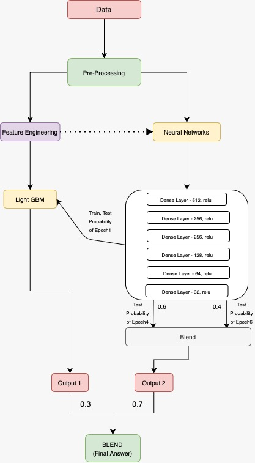

# Janatahack-Healthcare-Analytics-II

Team name: SabMohMayaHai

Team members: [Ashwin Kulkarni](https://www.linkedin.com/in/iashwin28/) and [Sayantan Basu](https://www.linkedin.com/in/sayantan-basu-a29861a1/)

Final rank : 10th on private leaderboard.

[Link to the leaderboard](https://datahack.analyticsvidhya.com/contest/janatahack-healthcare-analytics-ii/#LeaderBoard)

# Problem Explanation

In this problem, we were asked to predict the duration of stay of patients in a hospital. The solution was a blend of LGBM and a simple Neural Network architecture. We performed feature engineering to extract meaningful features for the LGBM model. Using the neural network probabilities as a feature for the LGBM model gave a big jump to the score. Although the competition was exciting the dataset didnot have interesting features that could actually capture the target variable distribution and hence none of the participants could cross 50% on the leaderboard.

# Dataset Format

# Solution Approach

